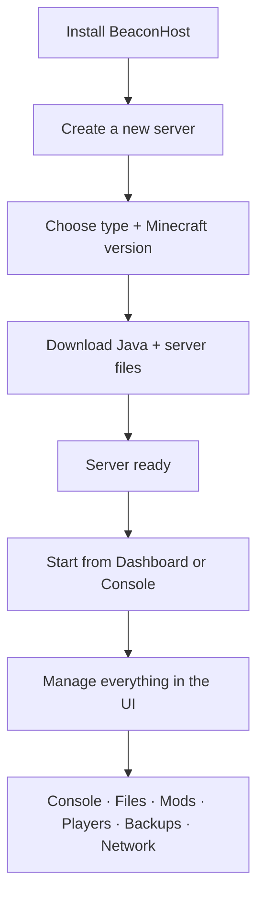

<p align="center">
  
</p>

<h1 align="center">BeaconHost</h1>

<p align="center">
  <strong>A free, open-source desktop app for creating and managing Minecraft servers.</strong><br/>
  Auto-downloads Java and server files · Full GUI · Arabic &amp; English UI
</p>

<p align="center">
  
  
  
</p>

---

## Table of contents

- [Overview](#overview)
- [Why BeaconHost](#why-beaconhost)
- [Supported server types](#supported-server-types)
- [How it works](#how-it-works)
- [Application guide](#application-guide)
  - [Dashboard](#dashboard)
  - [Console](#console)
  - [Mods & plugins](#mods--plugins)
  - [Files](#files)
  - [Players](#players)
  - [Performance](#performance)
  - [Settings](#settings)
  - [Network](#network)
  - [Backups](#backups)
- [Data storage](#data-storage)
- [Development](#development)
- [Building installers](#building-installers)
- [Project structure](#project-structure)
- [Important notes](#important-notes)
- [Roadmap](#roadmap)
- [License](#license)

---

## Overview

**BeaconHost** (named after the Minecraft *Beacon*) is a cross-platform desktop application that lets you **create, install, run, and manage Minecraft servers** from a single graphical interface.

Instead of manually finding Java, downloading server jars, editing configs in Notepad, and running commands in a terminal, BeaconHost:

1. **Downloads the correct Java runtime** (Eclipse Temurin) for your Minecraft version.
2. **Downloads and installs** the server software you choose (Paper, Fabric, Forge, etc.).
3. **Accepts the Mojang EULA** automatically during setup.
4. **Provides a full management UI** — live console, file editor, mod browser, player tools, backups, and network helpers.

The app is built with **Rust + Tauri 2** on the backend and **React + TypeScript** on the frontend. It runs natively on Windows, Linux, and macOS with a custom title bar and a modern glass-style UI. The interface supports **English and Arabic** (full RTL layout).

---

## Why BeaconHost

| Feature | What it does for you |
|--------|----------------------|
| **Automatic Java** | Downloads Temurin JRE 8 / 16 / 17 / 21 / 25 based on the Minecraft version you pick — no manual JDK installs |
| **Multiple servers** | Run many independent servers side by side, each in its own folder |
| **Live console** | Send commands, see colored output, search logs, and export log history |
| **Mod & plugin browser** | Search Modrinth, install from URL, or import a local `.jar` file |
| **Built-in file editor** | Monaco Editor with syntax highlighting for `yml`, `json`, `properties`, and more |
| **Visual settings** | Edit MOTD, RAM, port, gamemode, `online-mode`, view distance, and JVM flags without touching raw files |
| **Network tools** | Shows public/local IP, helps open firewall ports, and includes VPS provider notes |
| **Scheduled backups** | Manual backups or automatic schedules (hourly, daily, weekly, etc.) |
| **One-click optimize** | Applies Aikar JVM flags, tuned `server.properties`, and Paper/Spigot YAML settings |
| **Crash recovery** | Optional auto-restart when the server process exits unexpectedly |

---

## Supported server types

| Type | Category | Notes |
|------|----------|-------|
| **Paper** | Plugin (Bukkit/Spigot API) | Recommended for most survival servers — fast, stable, plugin ecosystem |
| **Purpur** | Plugin | Paper fork with extra tuning options |
| **Spigot** | Plugin | Built from source via BuildTools on first install (can take 10+ minutes) |
| **Velocity** | Proxy | Modern proxy for connecting multiple backend servers |
| **Vanilla** | Official | Pure Mojang server jar — no plugins or mods |
| **Fabric** | Modded | Lightweight mod loader |
| **Quilt** | Modded | Fabric-compatible mod loader |
| **Forge** | Modded | Runs the official Forge installer automatically |
| **NeoForge** | Modded | Runs the official NeoForge installer automatically |

BeaconHost picks compatible Minecraft versions from official APIs (PaperMC Fill, Mojang, Fabric, Quilt, Forge, etc.) and resolves the correct download for each type.

---

## How it works



**Typical workflow:**

1. **Install** the app on your machine (see [Building installers](#building-installers)).
2. **Create a server** — give it a name, pick a type (e.g. Paper), and select a Minecraft version.
3. **Wait for setup** — BeaconHost downloads Java, fetches the server jar, and prepares the server directory.
4. **Start the server** — use the Dashboard card or open the Console tab and press Start.
5. **Manage** — install mods/plugins, edit configs, manage players, configure backups, and open network ports.

---

## Application guide

When you open a server, BeaconHost shows a tabbed interface. Each tab covers one area of server management.

### Dashboard

The home screen lists all your servers. For each server you can:

- See status (stopped, starting, running, crashed, installing).
- **Start**, **stop**, or **restart** with one click.
- View quick stats (players online, RAM allocation, port).
- Switch between **grid** and **list** layout.
- **Create** a new server or **delete** an existing one.

### Console

A full **xterm.js** terminal connected to the live server process.

- Type Minecraft commands (`/help`, `/op`, `/whitelist add`, etc.) directly.
- Output is streamed in real time with ANSI color support.
- **Search** through the log buffer.
- **Export** logs to a file for debugging.
- Start/stop/restart controls are available in the server header.

### Mods & plugins

Depends on server type:

- **Mods tab** — shown for Fabric, Quilt, Forge, and NeoForge servers.
- **Plugins tab** — shown for Paper, Purpur, Spigot, and Velocity.

Features:

- **Modrinth browser** — results load automatically when you open the tab; search to filter further.
- **Install from URL** — paste a direct `.jar` download link.
- **Install from file** — pick a local `.jar` from your computer.
- **Enable / disable** content without deleting files (renames to `.jar.disabled`).
- **Remove** installed mods or plugins.

Compatible versions are filtered by your server's Minecraft version and loader type.

### Files

A file browser for the server directory with:

- Folder navigation and file listing.
- **Monaco Editor** for editing text files (`server.properties`, `spigot.yml`, `paper-global.yml`, etc.).
- Syntax highlighting based on file extension.
- Create, rename, delete files and folders.

### Players

Manage who can join and who has permissions:

| Section | Purpose |
|---------|---------|
| **Online** | See connected players; kick or ban them |
| **Whitelist** | Add/remove names; enable whitelist in settings |
| **Operators (OP)** | Grant or revoke admin permissions |
| **Banned** | View banned players and pardon them |

A security warning is shown if `online-mode` is disabled (allows cracked/offline clients).

### Performance

Tools to improve server tick rate and reduce lag:

- **Auto Optimize** — one-click tuning based on your RAM tier (low / mid / high):
  - Aikar JVM flags (G1GC, pause prevention).
  - `server.properties` (view distance, simulation distance, network compression).
  - `spigot.yml`, `bukkit.yml`, and Paper/Purpur configs.
  - Optional performance mods on Fabric (Lithium, FerriteCore, Krypton, etc.).
- **Chunk pre-generation** — installs Chunky and pre-generates chunks around spawn so exploration does not cause lag spikes.
- Contextual tips for lowering player ping (port forwarding, VPS placement).

### Settings

Organized into sections:

| Section | What you can change |
|---------|---------------------|
| **General** | Server display name, RAM slider, port, auto-restart toggle, custom JVM arguments |
| **World** | MOTD, max players, view distance, gamemode, difficulty, PvP, spawn protection, and other `server.properties` values |
| **Security** | `online-mode`, whitelist enforcement, and related options |

Changes are written to the server's config files on disk. Some settings require a server restart.

### Network

Helps players connect from outside your LAN:

- Displays your **public IP** (internet-facing) and **local IP** (LAN).
- **Firewall helper** — opens the server port in the OS firewall (Windows / Linux) and clears `server-ip` so the server listens on all interfaces.
- **Provider firewall notes** — reminders for VPS panels (AWS, Hetzner, etc.) where you must also open the port.
- Copy-ready connection address for sharing with players.

A global **Network** page is also available from the sidebar for app-wide network info.

### Backups

Protect your worlds and configs:

- **Back up now** — creates a timestamped `.zip` of world folders and key config files.
- **Automatic schedule** — choose from presets: off, hourly, every 6 hours, every 12 hours, daily, or weekly. The app runs a background scheduler that checks every 10 minutes and creates backups when due.
- **List & delete** — view backup date, size, and remove old archives.

Backups are stored in `servers/<id>/backups/` inside the app data directory.

---

## Data storage

BeaconHost stores all data in the OS app-data folder:

| Platform | Path |
|----------|------|
| **Windows** | `%APPDATA%\com.minc.app\` |
| **Linux** | `~/.local/share/com.minc.app/` |
| **macOS** | `~/Library/Application Support/com.minc.app/` |

Directory layout:

```
com.minc.app/
├── servers/
│   └── <server-id>/
│       ├── config.json          # Server metadata (name, type, RAM, port, backup schedule…)
│       ├── server.jar           # Or type-specific jar name
│       ├── server.properties
│       ├── world/               # Default world
│       ├── plugins/ or mods/    # Depending on server type
│       └── backups/             # Zip archives
├── java/
│   └── <major>/                 # Downloaded Temurin JRE per Java version
└── settings.json                # App preferences (language, etc.)
```

Each server is fully self-contained. You can back up or move a server folder independently.

---

## Development

### Prerequisites

- **Node.js** 20 or newer
- **Rust** stable toolchain
- [Tauri 2 prerequisites](https://v2.tauri.app/start/prerequisites/) for your OS (WebView2 on Windows, etc.)

### Run locally

```bash
# Install frontend dependencies
npm install

# Start the app in development mode (hot-reload frontend + Rust backend)
npm run tauri dev
```

### Frontend only (browser preview, limited — no Tauri APIs)

```bash
npm run dev
```

### Tech stack

| Layer | Technology |
|-------|------------|
| Desktop shell | Tauri 2 (Rust) |
| UI | React 19, TypeScript, Tailwind CSS 4 |
| Routing | React Router 7 |
| State | Zustand + TanStack React Query |
| Terminal | xterm.js |
| Editor | Monaco Editor |
| i18n | i18next (English + Arabic) |
| Animations | Framer Motion |

---

## Building installers

```bash
npm run build        # Compile TypeScript + bundle frontend
npm run tauri build  # Build native binary + platform installer
```

| Platform | Output location |
|----------|-----------------|
| **Windows** | `src-tauri/target/release/bundle/nsis/*.exe` and `msi/*.msi` |
| **Linux** | `.deb`, `.rpm`, `.AppImage` in `src-tauri/target/release/bundle/` |
| **macOS** | `.dmg` in `src-tauri/target/release/bundle/dmg/` |

The release binary is also at `src-tauri/target/release/minc` (or `minc.exe` on Windows).

---

## Project structure

```
BeaconHost/
├── public/                 # Static assets (logos)
├── src/                    # React frontend
│   ├── components/         # UI components (Sidebar, TitleBar, ContentBrowser…)
│   ├── pages/              # Dashboard, Network, server tabs
│   ├── lib/                # API client, events, firewall helpers
│   ├── store/              # Zustand stores
│   ├── i18n/               # en.json, ar.json translations
│   └── theme/              # Design tokens
├── src-tauri/              # Rust backend
│   ├── src/
│   │   ├── commands/       # Tauri IPC commands (servers, files, backups, content…)
│   │   ├── providers.rs    # Download resolvers (Paper, Forge, Fabric…)
│   │   ├── process.rs      # Server process management
│   │   └── state.rs        # App state, server config types
│   └── tauri.conf.json     # Tauri app configuration
├── logo_github.png         # Project logo
├── package.json
└── README.md
```

---

## Important notes

- **Spigot** is compiled from source using BuildTools. The first install can take **10–20 minutes** depending on your CPU and network.
- **Forge / NeoForge** run their official installers after download. Wait for the install step to finish before starting the server.
- **EULA** is accepted automatically (`eula=true`) when a server is created. You are still bound by the [Minecraft EULA](https://www.minecraft.net/en-us/eula).
- **RAM** — do not allocate all system memory to a server. Leave headroom for the OS and the BeaconHost app itself.
- **online-mode** — disabling it allows non-premium clients but reduces security. BeaconHost shows a warning when this is off.
- **Mods require restart** — installing or toggling mods/plugins takes effect after the next server start.

---

## Roadmap

- [ ] Optional BeaconHost cloud hosting integration
- [ ] One-click server templates (Survival, Skyblock, Minigames)
- [ ] Desktop notifications on server crash
- [ ] Import/export server profiles between machines
- [ ] Bedrock support via Geyser from the UI
- [ ] In-app auto-update

---

## License

BeaconHost is released under the **[MIT License](LICENSE)**.

You are free to use, modify, and distribute this software with minimal restrictions. See the [LICENSE](LICENSE) file for the full text.

---

<p align="center">
  <sub>BeaconHost · Rust + Tauri 2 + React · MIT License</sub>
</p>
